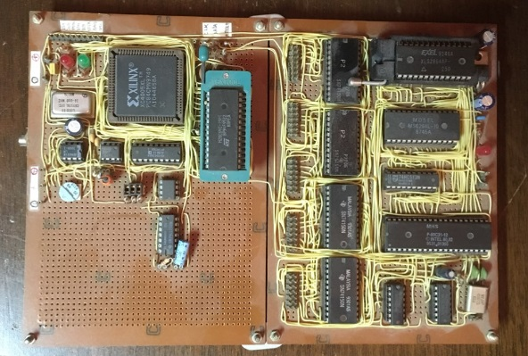

This project is a audio synthesiser using a midi interface. It is implemented using a Xilinx FPGA.

The FPGA was developed using the Xilinx Foundation Series Software. A schematic was created to generate the bitstream to be stored in an external serial EEPROM.
A 8051 micro-controller is used to scan a 61 key keyboard and send the command to play notes to the fpga using a serial wire.

Sadly the design files of this project were lost. I may have some paper documentation and will post it here as soon as i find it.

